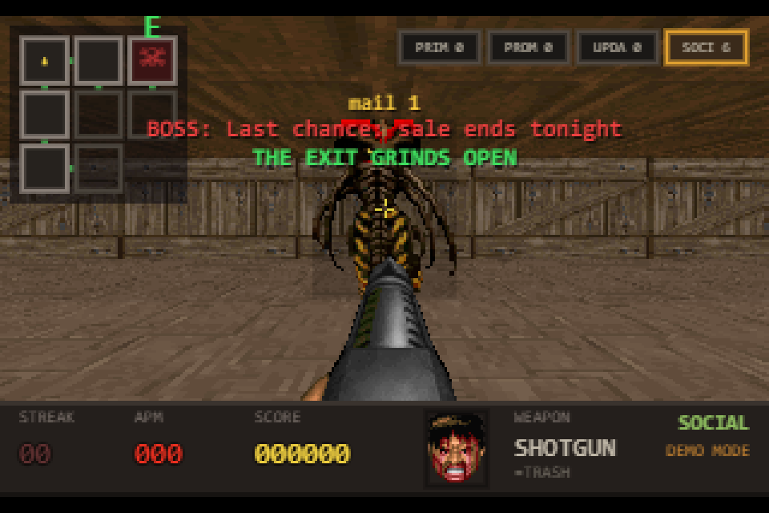

# ZERO RAID

**Your inbox is a dungeon. Clear it.**

▶ **Play live: https://zero-raid.vercel.app** — press `D` on the title screen for Demo mode
(live Gmail sign-in is in Google OAuth *Testing* mode, so only allow-listed test users can connect a real inbox).



A DOOM-style (1993) first-person email triage game built for Hackyard Yard #4.
Every demon is a **real unread email** in your Gmail. Every kill is a **real
mutation** — archive, trash, star, or a threaded reply. This is not
email-themed wallpaper: the only way to win is to actually hit inbox zero.

## How the real chore gets done

Built for Hackyard Yard #4 (Gamification, sponsored by Ryware), whose rule is
*the real chore has to get done*. Zero Raid signs in with Google (scopes
`gmail.modify` + `gmail.send` only) and every hit calls the Gmail REST API on
the actual message: pistol = archive, shotgun = trash, chainsaw = star,
Hellfire = a real threaded reply that then archives the thread. Clear every
level and you have reached real inbox zero.

## How it plays

Your Gmail categories are dungeon levels: **Primary → Promotions → Updates →
Social**. Each level is a maze of rooms joined by sliding doors; unread mail
(capped at 20 per category) is dealt out across the rooms as demons with the
subject line floating overhead. A room's doors unlock when it's cleared; the
**boss** — the most important unread, server-ranked — holds the farthest room
and the exit. Shoot barrels. Watch for fireballs.

| Control | Weapon | Real Gmail action |
|---|---|---|
| `WASD` / arrows, mouse | — | Move / turn, look up/down (click to lock pointer) |
| `TAB` (hold) | — | Automap |
| `1` + click | Pistol | **Archive** (remove INBOX+UNREAD) |
| `2` + click (or right-click) | Shotgun | **Trash** — cone AoE |
| `3` + hold click | Chainsaw | **Star** — works on anything, incl. cursed |
| `4` or `E` | Hellfire spell | **Reply** — sends a real Gmail reply + archives |

**Violet "cursed" demons** are mail that smells like it needs an answer
(`Re:`, `?`, `RSVP`, `review`, `confirm`, …). Bullets spark off their shield —
you either cast Hellfire and *actually reply*, or chainsaw-star it to defer.
Deeper levels spawn more cursed demons, faster. That tension is the game.

**HUD** (bottom status bar): `STREAK` = consecutive successful actions without
getting mauled (it is your health — a demon touch resets it), `APM` = actions
per minute (your ammo), `SCORE`, weapon, room. Top-right mini-map shows room
clear state.

## Run it

```bash
npm install
cp .env.example .env   # fill in Google OAuth creds (below)
npm run dev            # API on :8787, game on http://localhost:5173
```

### Google OAuth setup (~5 min)

1. Google Cloud Console → create project → enable **Gmail API**.
2. OAuth consent screen → External → add scope `gmail.modify` + `gmail.send`,
   add yourself as test user.
3. Credentials → OAuth client ID (Web) → redirect URIs:
   `http://localhost:5173/api/callback` and `https://<your-app>.vercel.app/api/callback`.
4. Put `GOOGLE_CLIENT_ID`, `GOOGLE_CLIENT_SECRET`, `SESSION_SECRET` (any long
   random string, e.g. `openssl rand -hex 32`) in `.env`. Optionally set
   `GOOGLE_REDIRECT_URI` (defaults to `{request origin}/api/callback`).
   `server/dev.ts` loads `.env` automatically; `.env` is gitignored.

### No Google creds? Demo mode

If env vars are missing the server runs **demo mode**: seeded fake mail, all
actions simulated server-side, clearly labeled `DEMO MODE` in the HUD. With
creds configured you can still force it via the `D` key on the title screen or
`DEMO_MODE=1`.

## Deploy (Vercel)

```bash
npx vercel        # framework preset: Vite; api/*.ts become serverless fns
# add each var for production (values via prompt/stdin):
npx vercel env add GOOGLE_CLIENT_ID production
npx vercel env add GOOGLE_CLIENT_SECRET production
npx vercel env add SESSION_SECRET production
npx vercel env add GOOGLE_REDIRECT_URI production   # https://<your-app>.vercel.app/api/callback
npx vercel --prod
```

The `api/` handlers are plain Node `(req, res)` functions — they deploy as
Vercel serverless functions unchanged, and `server/dev.ts` mounts them on
Express for local dev. Sessions live in an AES-256-GCM encrypted cookie; no
database.

## Privacy

- Least-privilege scopes: `gmail.modify` and `gmail.send` only.
- OAuth tokens live only in your browser, inside an AES-256-GCM encrypted,
  HTTP-only session cookie. There is no database and nothing is stored server-side.
- The game only touches mail when you fire a weapon at it. `/api/logout` clears the session.

## Demo script (for the video)

1. Title screen → "LIVE: you@gmail.com" → Enter.
2. **Level 1 PRIMARY**: pistol-archive a couple of imps (watch Gmail: the
   thread leaves the inbox), shotgun-trash a cluster, chainsaw-star one.
3. Violet demon → press `4`, type a one-liner, `Ctrl+Enter` — the reply is
   really sent (check the thread in Gmail: replied + archived).
4. Room hits zero → door opens → walk through → **Level 2 PROMOTIONS** with
   fresh demons. Mini-map shows `PRIM CLR`.
5. Hard cut to Gmail: unread count visibly dropped.

## Tech

- Front end: Vite + TypeScript + a hand-rolled software raycaster on
  `<canvas>` — textured DDA walls, Wolf3D-style thin sliding doors, per-pixel
  floor/ceiling casting, 8-rotation billboard sprites with a per-column
  z-buffer, 16-band colormap-style sector lighting, WebAudio-synthesized SFX.
  ~29 KB of JS gzipped.
- Levels: seeded room mazes (DFS spanning tree + loops) per Gmail category;
  the boss (server-ranked most important unread) holds the farthest room.
- Back end: 7 tiny Node handlers (`api/`), Gmail REST API via `fetch`
  (no googleapis dependency), encrypted-cookie sessions.
- Scopes: `gmail.modify`, `gmail.send`. Nothing else.

## Art credits

Monsters, weapons, textures, flats and the status-bar face are from
**[Freedoom](https://freedoom.github.io/)**, © Contributors to the Freedoom
project, used under the 3-clause BSD license — see
`public/freedoom/COPYING.adoc` and `public/freedoom/CREDITS`. Freedoom is not
affiliated with this project. `npm run assets` re-fetches the curated subset
(~1.8 MB) from the Freedoom source repository.

If the Freedoom assets fail to load, the game falls back to its original
procedurally generated art (`src/painter.ts`, `src/textures.ts`) — nothing
else changes.

## License

Code: MIT — see LICENSE. Freedoom assets: BSD-3-Clause (see above).
